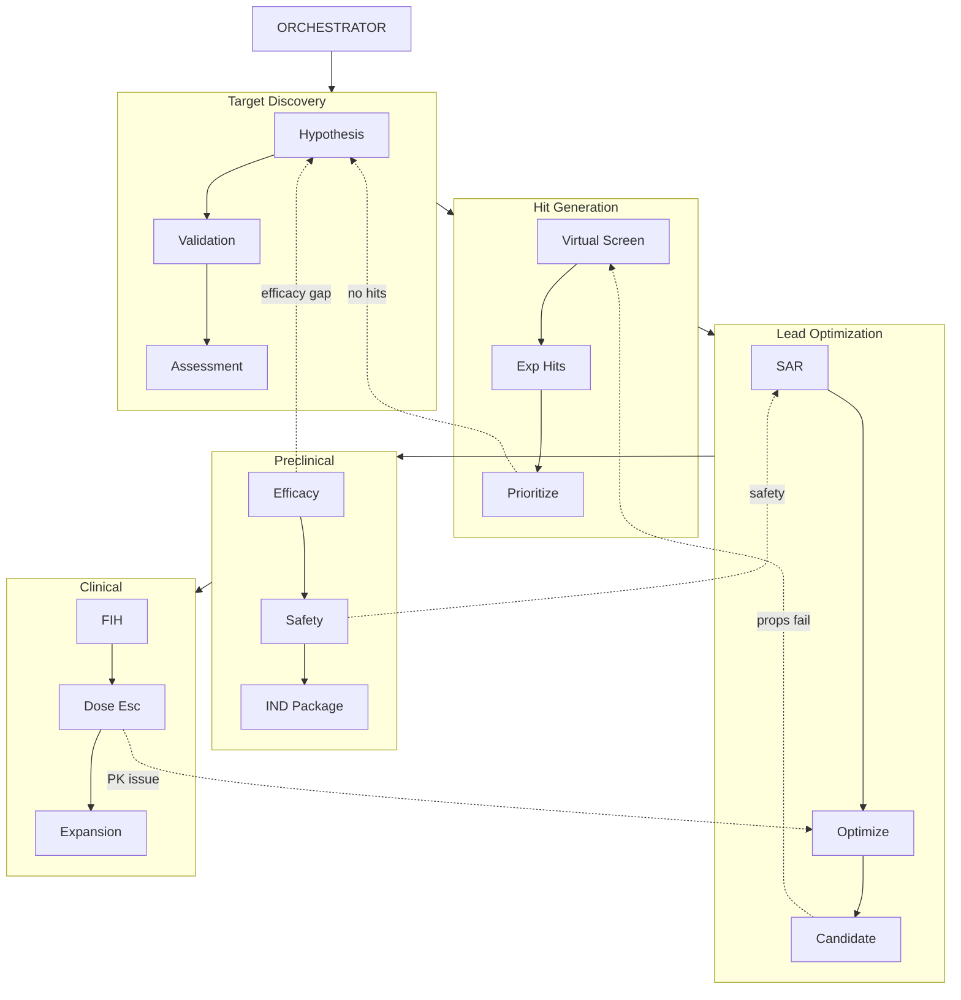
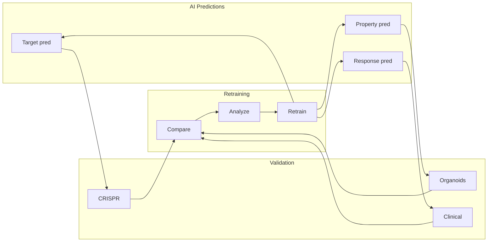
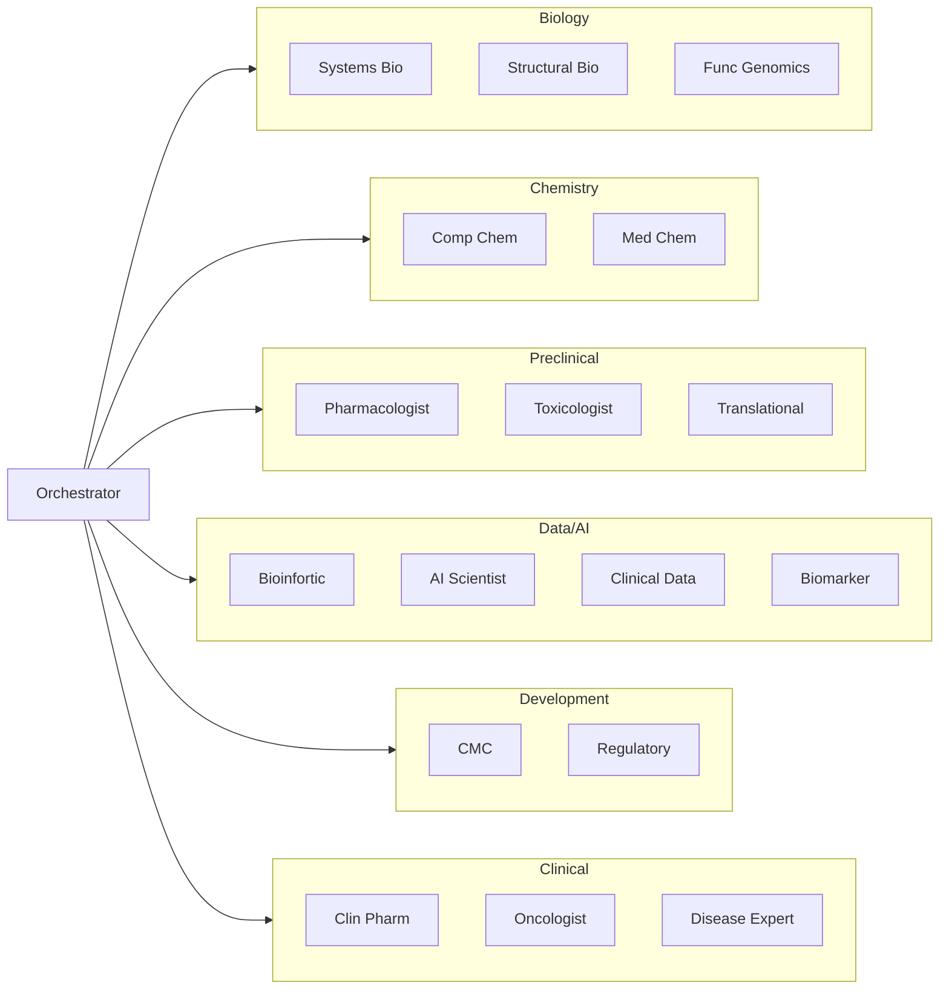
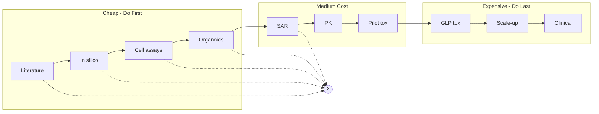
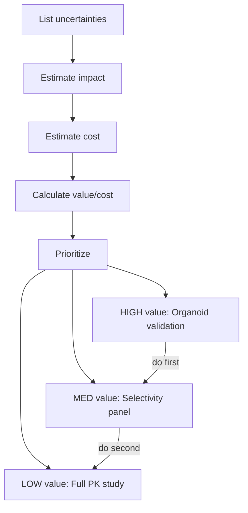

# AI Drug Discovery Pipeline - Orchestrator Workflow

## Core Objective

**Maximize evidence gathered and de-risking per unit of time and money spent.**

The orchestrator continuously asks:
- What's the highest-value question to answer next?
- What's the cheapest experiment that could kill this program?
- What can we run in parallel vs. what must be sequential?
- Are we learning fast enough for the resources deployed?

## Organic Pipeline Flow

The orchestrator manages a non-linear, iterative workflow where stages can cycle, backtrack, or jump based on experimental outcomes and strategic decisions.

## Closed-Loop Learning

## Specialist Teams

## Kill Early Funnel

## De-Risking Prioritization

## Backtracking Triggers

| Current Stage | Backtrack To | Trigger | Specialists |
|---------------|--------------|---------|-------------|
| Hit Gen | Target | No druggable chemotypes | Struct Bio → Systems Bio |
| Lead Opt | Hit Gen | SAR flat | Med Chem → Comp Chem |
| Lead Opt | Target | Mechanism invalid | Pharm → Systems Bio |
| Preclinical | Lead Opt | Safety margins | Tox → Med Chem |
| Preclinical | Target | Efficacy gap | Translational → Systems Bio |
| Clinical | Lead Opt | Human PK differs | Clin Pharm → Med Chem |
| Clinical | Target | Biomarker fails | Biomarker → Systems Bio |

## Decision: Parallel vs Sequential

**Run in Parallel when:**
- Experiments are independent
- Both answers needed anyway
- Time is the main constraint

**Run Sequentially when:**
- Result A determines if B is worth doing
- Resources are limited
- One experiment could kill program

| Parallel OK | Sequential Required |
|-------------|---------------------|
| Multiple compound synthesis | Target validation → then screening |
| Target validation + hit screening | Hit confirmation → then optimization |
| PK study + efficacy study | Safety → then IND filing |
| Different tumor organoid types | FIH results → then expansion design |
